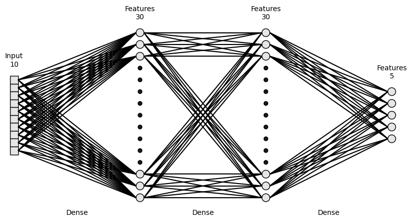
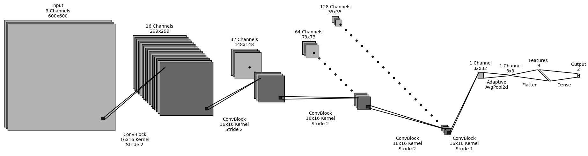
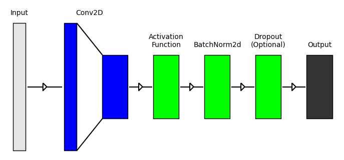

# PyDrawNet
A python utility for plotting neural network (and other) diagrams





Example files have been created to demonstrate the capabilities of the project.

### Requirements
- python 3+
    - tested on 3.12 only
- matplotlib
    - tested on 3.8.1 only

### How It Works
##### Layers
Layers are classes that represent "objects", like nodes or images. They create one or more matplotlib collections for rendering, as well as holding useful graphic properties like corner coordinates and total height/width. See "example_1_layers.py" for the currently available layers.

##### Operations
Operations are classes that create connections between layers, such as convolutions, dense lines, or arrows. They create one or more matplotlib collections for rendering. See "example_2_ops.py" for the currently available operations.

##### Renderers
Currently only a sequential renderer class (SeqRenderer) is implemented, which works as follows: layers are rendered one after another from left to right, with operations connecting adjacent layers (no skip-connections). Normally, the renderer calls `plt.show`, but this can be disabled to allow further customization outside of its capabilites.

### Usage

```
from pydrawnet import SeqRenderer, layers, operations

# The renderer must first be created
SR = SeqRenderer()

# Layers and operations are then added to the renderer
# Note that the order matters for layers and operations, separately
SR.add_layer(layers.BlockLayer(50, 50))
SR.add_operation(operations.ArrowOp())
SR.add_layer(layers.BlockLayer(10, 50))
SR.add_operation(operations.ArrowOp())
SR.add_layer(layers.BlockLayer(50, 10))
SR.add_operation(operations.LinearOp())
SR.add_layer(layers.BlockLayer(50, 75))

# This is equivalent to:
# SR.add_layer(layers.BlockLayer(50, 50))
# SR.add_layer(layers.BlockLayer(10, 50))
# SR.add_layer(layers.BlockLayer(50, 10))
# SR.add_layer(layers.BlockLayer(50, 75))

# SR.add_operation(operations.ArrowOp())
# SR.add_operation(operations.ArrowOp())
# SR.add_operation(operations.LinearOp())

# Plot the resulting graphic
SR.render()
```