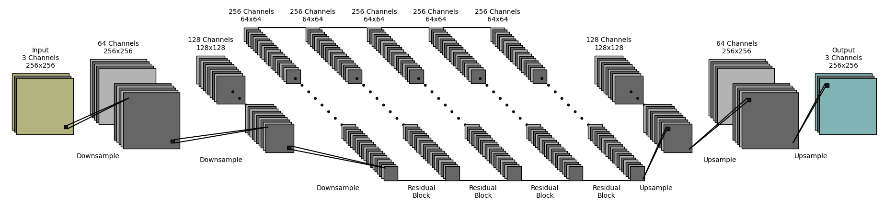

# PyDrawNet
A python utility for plotting neural network (and other) diagrams




Example files and [this notebook](https://github.com/nhansendev/PyDrawNet/blob/main/examples/examples.ipynb) have been created to demonstrate the capabilities of the project.

### Requirements
- python 3+ (tested on 3.12 only)
- matplotlib (tested on 3.8.1 only)

### How It Works
##### Layers
Layers are classes that represent "objects", like nodes or images. They create one or more matplotlib collections for rendering, as well as holding useful graphic properties like corner coordinates and total height/width.


##### Operations
Operations are classes that create connections between layers, such as convolutions, dense lines, or arrows. They create one or more matplotlib collections for rendering and can be combined (overlaid) arbitrarily. 


##### Renderers
Currently two renderers are implemented:

- The sequential renderer class (SeqRenderer) renders layers one after another from left to right, with operations connecting adjacent layers (no skip-connections). 
- The free-form renderer class (FreeformRenderer) requires layers to be specified with unique IDs, which operations are then attached to. All placement is manual except where automatic vertical centering is used (default).

Normally, the renderers call `plt.show`, but this can be disabled to allow further customization outside of their capabilites.

### Installation
From within pydrawnet folder:
```
pip install .
```

To uninstall:
```
pip uninstall pydrawnet
```

### Basic Usage

See [the examples notebook](https://github.com/nhansendev/PyDrawNet/blob/main/examples/examples.ipynb).